# 🎓 Sistema de Gerenciamento Acadêmico (API Aluno Online)

Este projeto consiste em uma API REST desenvolvida com **Java** e **Spring Boot** para o gerenciamento de uma instituição de ensino.

## 🛠 Tecnologias Utilizadas

*   **Java 17+**
*   **Spring Boot** (Web, Data JPA)
*   **Banco de Dados:** (H2 ou PostgreSQL)
*   **Lombok**
*   **DBeaver**
*   **Insomnia**

---

## 📡 Endpoints e Testes

### 1. 👨‍🏫 Controller: Professor

#### **Criar Professor (POST)**
> **Insomnia:**
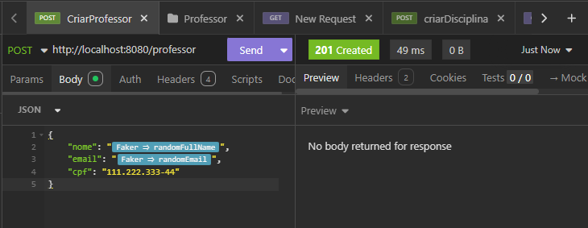> 
> **Banco de Dados:**
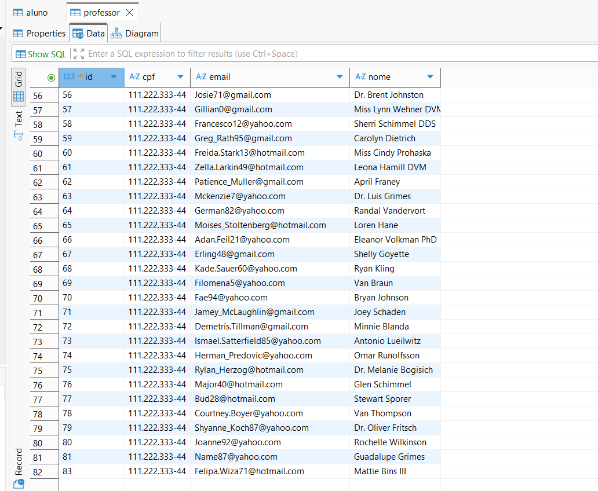
#### **Listar Professores (GET)**
> **Insomnia:**
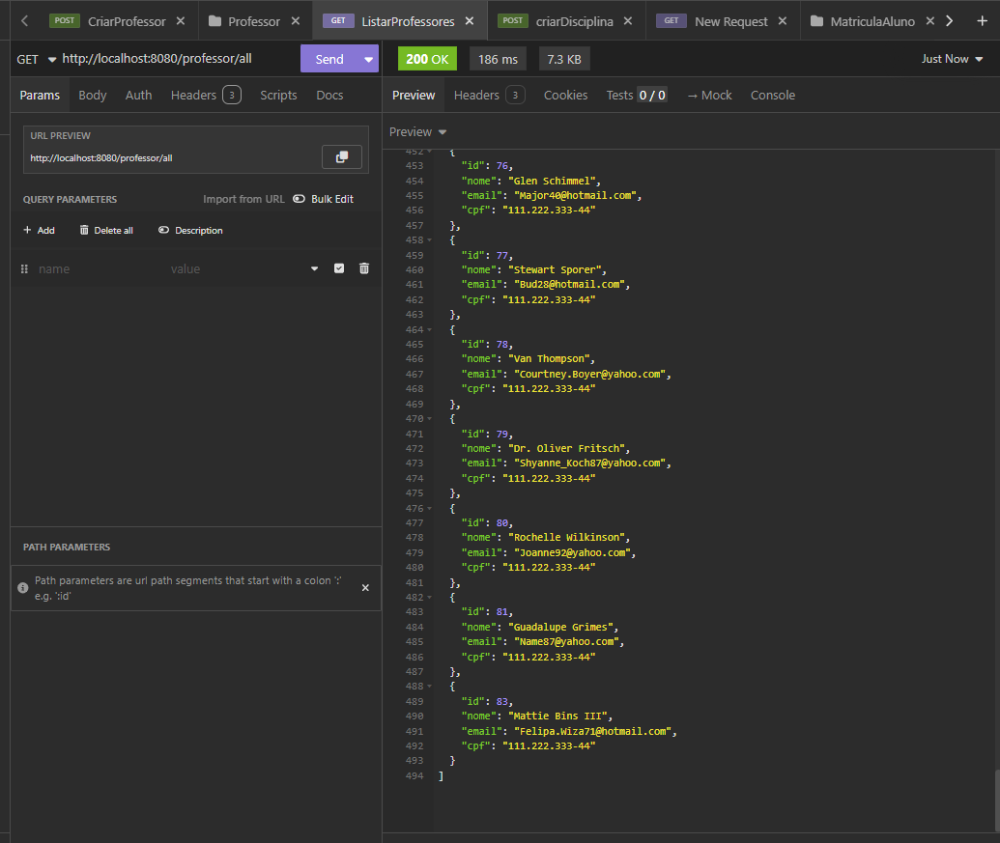
#### **Atualizar Professor (PUT)**
> **Insomnia:**
>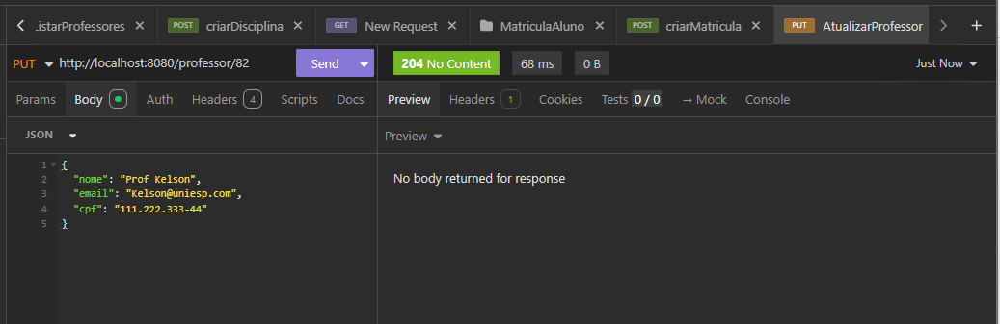
> **Banco de Dados:**
>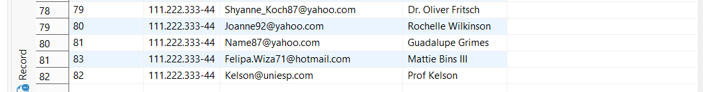
#### **Deletar Professor (DELETE)**
> **Insomnia:**
> 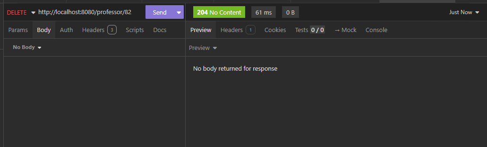
> **Banco de Dados:**
> 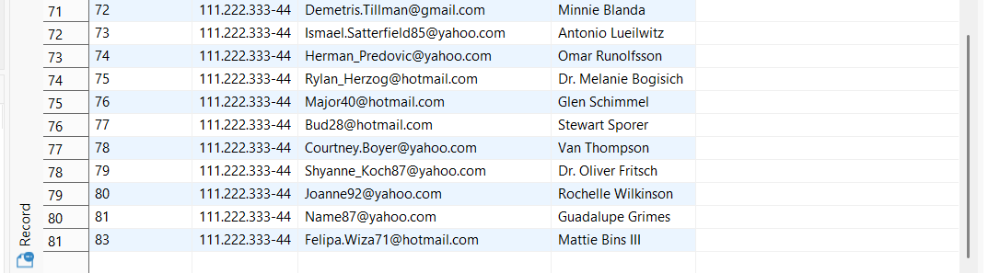
---

### 2. 👨‍🎓 Controller: Aluno

#### **Criar Aluno (POST)**
> **Insomnia:**
> 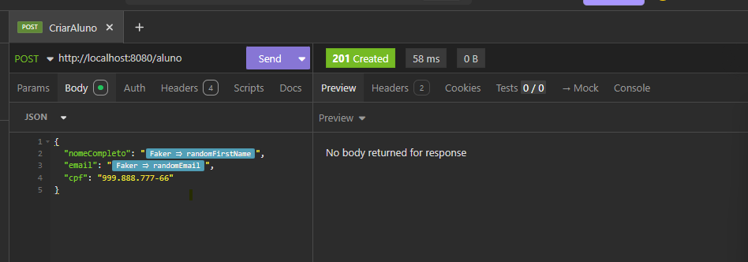
>
> **Banco de Dados:**
> 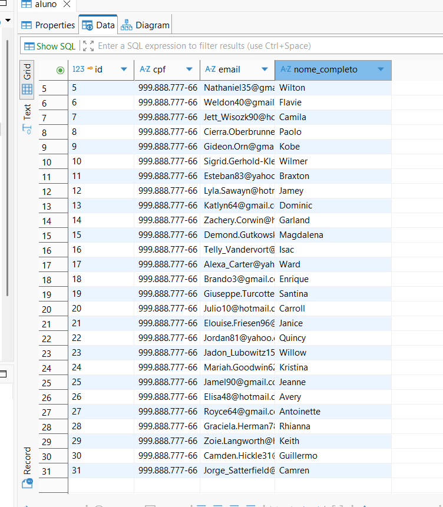

#### **Listar Alunos (GET)**
> **Insomnia:**
> 
> 
#### **Atualizar Aluno (PUT)**
> **Insomnia:**
> 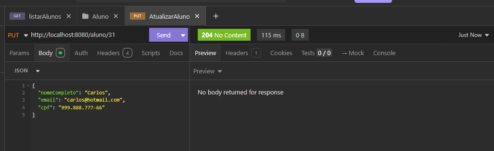
>
> **Banco de Dados:**
> 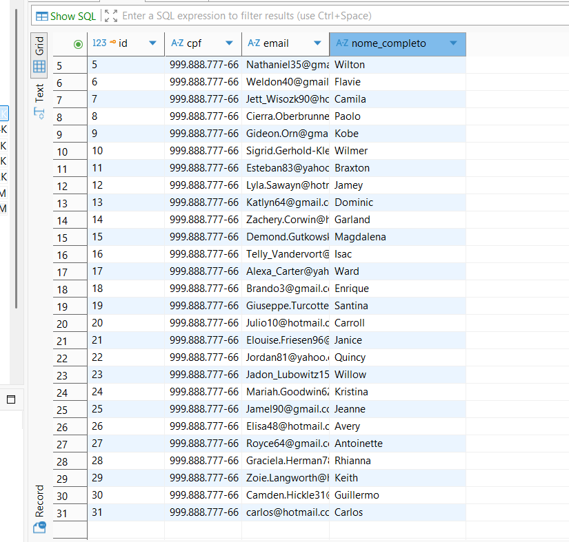

#### **Deletar Aluno (DELETE)**
> **Insomnia:**
> 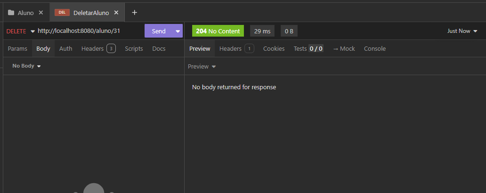
>
> **Banco de Dados:**
> 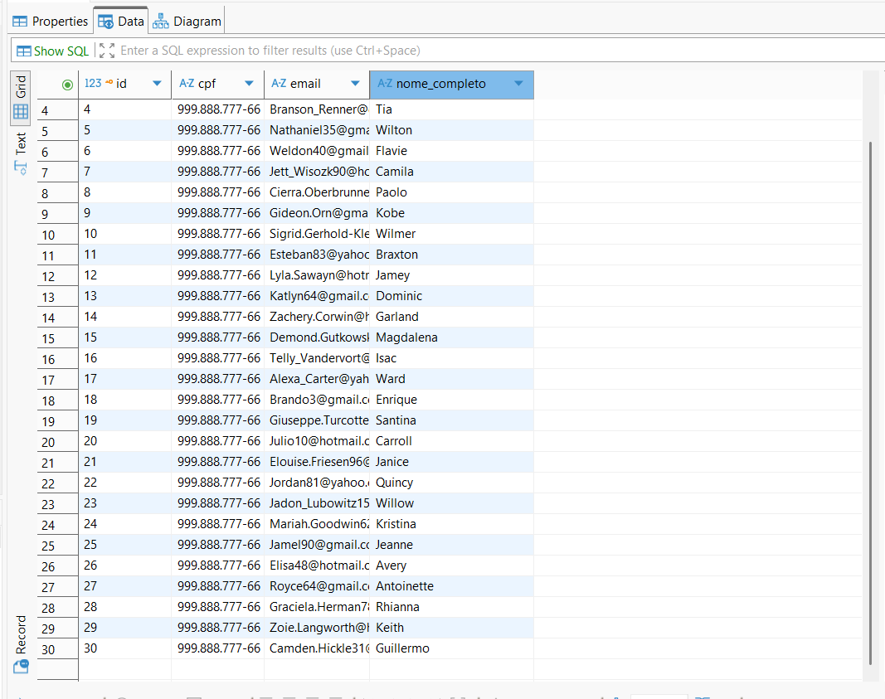

---

### 3. 📚 Controller: Disciplina

#### **Criar Disciplina (POST)**
> **Insomnia:**
> 
>
> **Banco de Dados:**
> 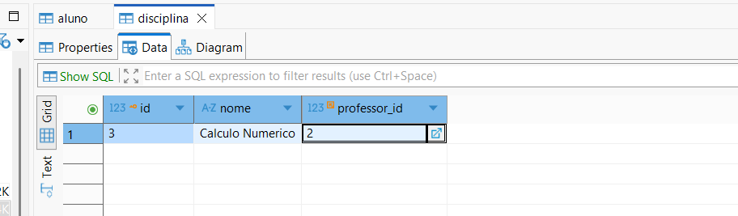

#### **Listar Disciplinas (GET)**
> **Insomnia:**
> 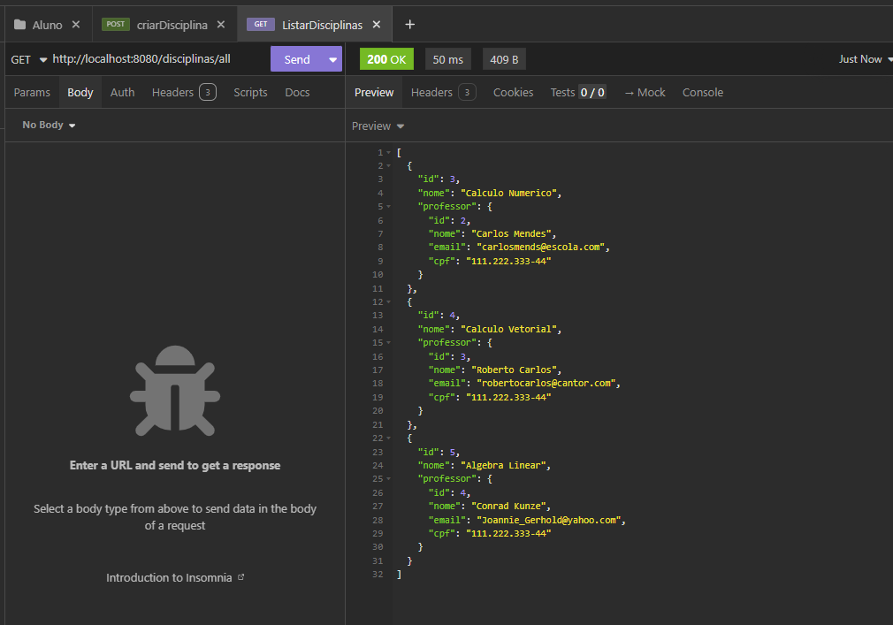

#### **Atualizar Disciplina (PUT)**
> **Insomnia:**
> 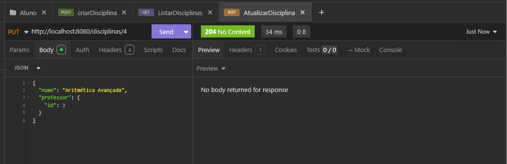
>
> **Banco de Dados:**
> 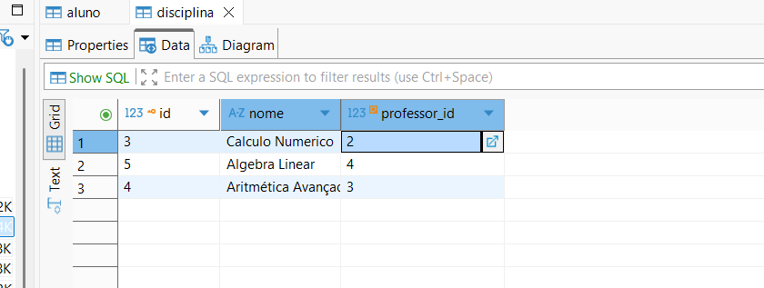

#### **Deletar Disciplina (DELETE)**
> **Insomnia:**
> 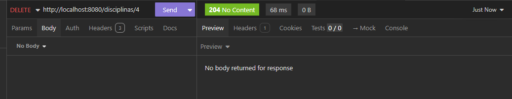
>
> **Banco de Dados:**
> 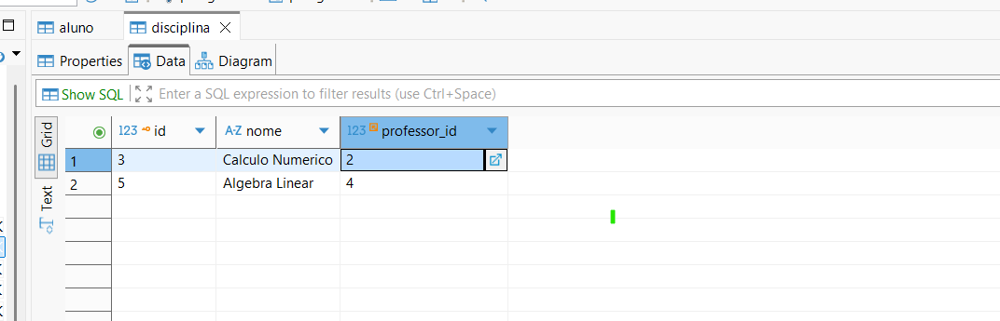

---

### 4. 📝 Controller: Matrícula

#### **Realizar Matrícula (POST)**
> **Insomnia:**
> 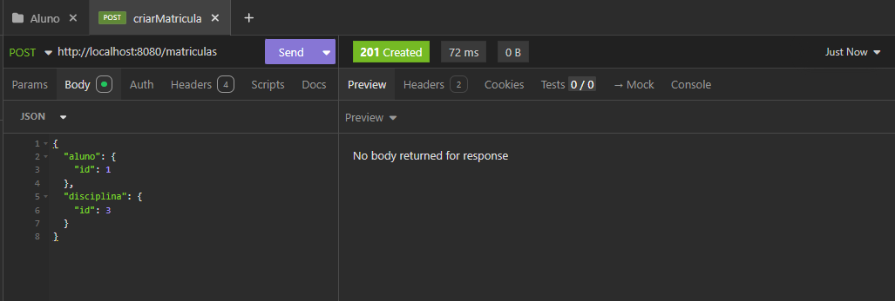
>
> **Banco de Dados:**
> 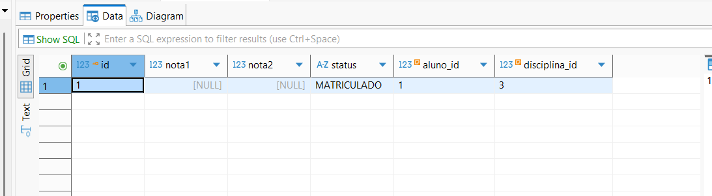

#### **Atualizar Notas (PATCH)**
> **Insomnia:**
> 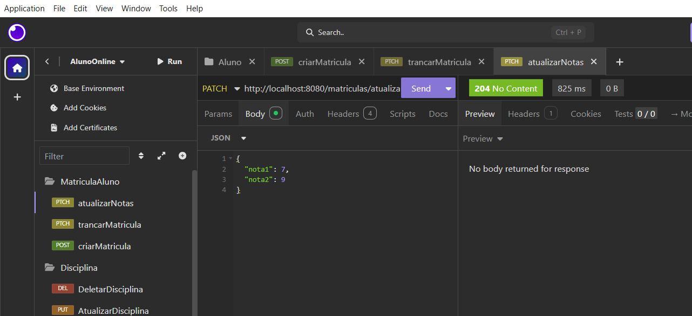
>
> **Banco de Dados:**
> 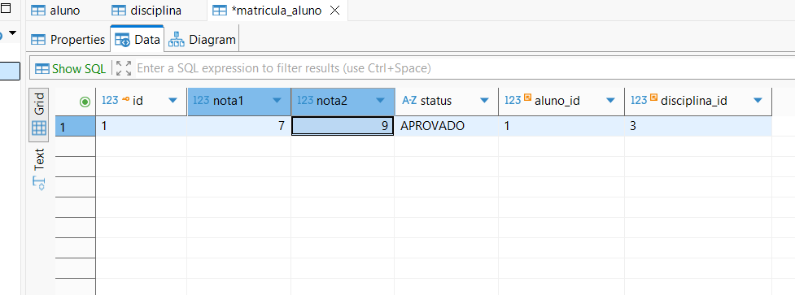

#### **Trancar Matrícula (PUT/PATCH)**
> **Insomnia:**
> 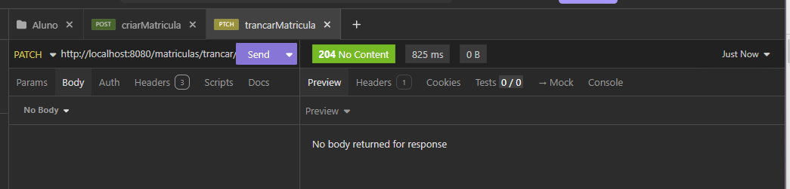
>
> **Banco de Dados:**
> 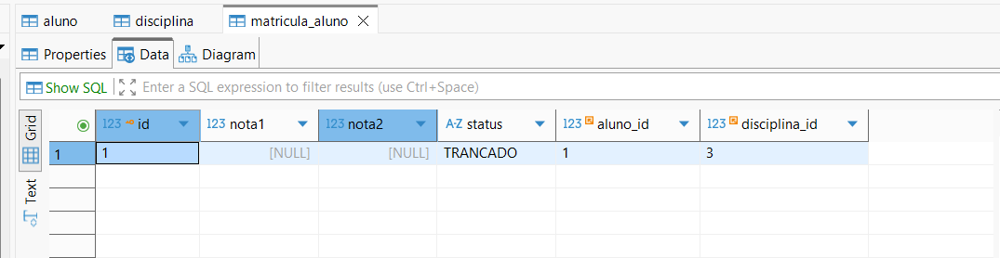